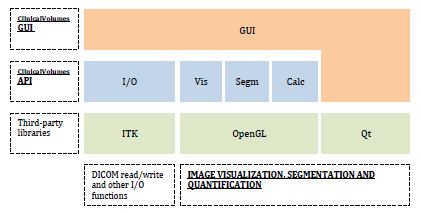
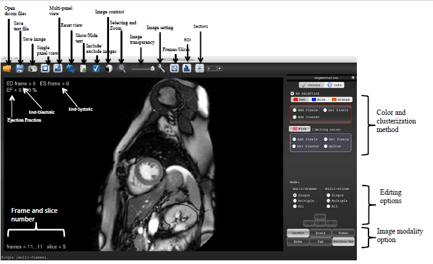
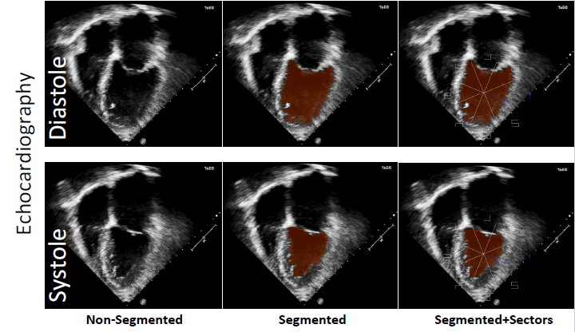

# ClinicalVolumes-medical-imaging-software

## Abstract
Background: Modern medical imaging relies on the accurate and rapid image analysis due to the large size of datasets collected on a daily basis both in clinical and pre-clinical imaging, for diagnosis, treatment planning, and research purposes. In order to improve the technology behind such requirements, here we introduce a new image analysis software called ClinicalVolumes. ClinicalVolumes is a semi-automatic image volume analysis tool based on a clustering signal intensity threshold-based method. It has been developed in C++ and can run on both Windows and Mac OS X operating systems. The program is currently available for research use only at https://www.kaggle.com/datasets/prot78/clinicalvolumes. 

Results: ClinicalVolumes has been validated with several MRI applications but it also can process Echocardiography and CT images. MRI datasets of clinical cardiac cases, and pre-clinical mouse models of heart, brain and adipose tissues have been analyzed by the ClinicalVolumes software and results were compared to a full manual segmentation. Bland-Altman analysis, intra- and inter-observer variability are reported for all investigated MRI applications as a numeric validation. The accuracy error was estimated to be below 10% and the segmentation was from 2 to 4 times faster, depending on the application, when compared to a full manual segmentation.

Conclusions: ClinicalVolumes is a fast, robust, user-friendly and accurate tool for image segmentation aimed to improve volume analysis in numerous medical applications ranging from cardiovascular disease to tumor and brain imaging.           

Keywords: segmentation; volumes; MRI; Echocardiography; CT; clinical; pre-clinical; DICOM.

## Background
Image segmentation plays a central rule in the increasing number of multidimensional and multimodality datasets generated by digital imaging techniques [1, 2]. The medical field, in particular, relies on computer programs to study the large amount of data collected by medical equipment, such as Magnetic Resonance Imaging (MRI), Echocardiography or Computer Tomography (CT), in order to improve diagnosis or determine appropriate treatment [3]. The progression towards automated or semi-automated segmentation software, which can provide accurate results in a shortened analysis time, is therefore of critical interest [4].

Tissue volume analysis such as that of heart [5], brain [6], cancer [7], vascular tissues, bones, or adipose tissues [8], provides a powerful tool to investigate functional and volumetric parameters. In cardiac studies, for instance, ejection fraction (EF), left ventricle end-diastolic volume (LVEDV) and left ventricle end-systolic volume (LVESV), are essential parameters to determine the conditions of the organ and the health status of the patient. An accurate and reliable segmentation of the left ventricle (LV) is therefore of great clinical and pre-clinical interest. The same applies to all medical imaging fields where accurate and reliable segmentations can result in useful diagnostic information so as to help target treatments. 

Recent years have seen a rapid evolution of medical image analysis software [4, 9-11]. However a large number of those are specifically designed to investigate single organs rather than providing a means for broader applications. The software here introduced, named ClinicalVolumes, was validated on MR volumes but has the potential to also analyze images from other medical imaging modalities including echocardiography, computed tomography (CT) or positron emission tomography (PET) in addition to be a specific application software. ClinicalVolumes is able to reduce analysis time with respect to a full manual segmentation by using an efficient clustering threshold-based technique to limit areas of interest and also by a rich set of user-friendly graphical-editing capabilities. The software exploits an automatic segmentation together with a user-friendly manual image optimization approach thus making ClinicalVolumes a valuable semi-automated program. 

The accuracy and efficiency of the new software has been evaluated for several MRI applications and the results are here reported. The tool is routinely used to perform cardiovascular MRI image analysis in our laboratories, thereby providing valuable diagnostic information for pre-clinical studies in murine models of cardiac diseases [12]. 

## Method
The design, implementation, medical applications and validation of the software are described in this section.

### A. Design

A.1. Overview

ClinicalVolumes is a volumetric analysis software relying on an efficient clustering threshold-based technique to limit areas of interest in a semi-automated way. The software is intended to process images or image stacks (a single image (2D), a time-resolved single image (2D+T), a stack of images representing a multi-slice image volume (3D) or a time-resolved multi-slice image volume (3D+T)).
The software loads and stores data in DICOM format, the standard format for handling, storing, printing, and transmitting information in medical imaging. Single volumes are typically uploaded and analyzed. This operation itself neglects the use of very large datasets of the order of Gigabytes (single medical volumes are usually smaller than 1Gb) which could exceed the computer RAM, used for I\O, thus sensibly affecting the analysis time.
When working with 3D+T images, the data is visualized and processed in four main modalities, which can be selected by the user: single-frame, single-slice, multiple-frames and multiple-slices.
The image analysis is achieved by segmenting the areas of interest with a threshold-based technique: a set of connected pixels, called “cluster”, with Signal Intensities (SI) contained within a user-selected intensity window can be generated in an area of interest. The cluster can be propagated through the volume making left ventricular endocardial border detection a trivial task. For accuracy purposes the cluster can be locally improved whenever the region of interest becomes inadequate. This can be carried out by manually modifying the cluster; mouse-based editing capabilities serve this purpose. ClinicalVolumes can also generate multiple clusters in different areas simultaneously. All the editing options are accessed with the mouse. 
The software also enables the employment of a series of options during the segmentation process. With a single mouse click, the aforementioned cluster can be expanded to any frame or slice. Single or multiple slices can be selected to be included or excluded by the segmentation activities. Commands such as global and selective zoom, contrast adjustment, ROIs for signal intensity histogram, sector and spline-based analysis have been successfully integrated. All the features provide a user-friendly approach to the program.  

A.2. Clustering algorithm

ClinicalVolumes segments volumes by generating a cluster from a user-selected image position that is then propagated to nearby pixels. The cluster expands through those image pixels whose signal intensity falls into a user-selected intensity window. The clustering algorithm uses the following inputs:
(a) the intensity of each pixel of the slice to operate on;

(b) the buffer that stores the editing color for each such pixel, called `color buffer';

(c) the currently selected editing mode and color;

(d) the coordinates of the selected pixel in (a)
from which the clusterization is started;

(e) the function that 
determines what is the action to undertake on a currently processed pixel
given its intensity, its color (if any) and its mode and color.

Furthermore, the clustering relies on a graph growing propagation scheme based on the usage of temporary buffers which register and exchange input information. 
The clustering algorithm was implemented as followed.
Firstly, the current editing color is written in the color buffer at the position
indicated by the coordinates of the selected pixel (d) (step 1). The coordinates of the selected pixel are registered in the first temporary buffer (step 2).
The eight neighbor pixel of the mouse-pointed pixel are examined. The
neighbor pixels are (re)colored, if deemed so according to (e), and
their coordinates are written in the second temporary buffers (step 3).
The two temporary buffers are than swapped and the number of non-empty
elements of the first temporary buffer is zeroed (step 4).
Steps 3) and 4) are repeated for each pixel indicated by the first temporary
buffer, instead of the mouse-pointed pixel - as specified in (step 3) - until this buffer
is empty.
The clustering algorithm operates sequentially on multiple image slices or on 
the current one only, depending on the editing mode decided by the user. For a 
specific slice, the algorithm takes as input: 
(a) the coordinates of the slice pixel 
defined by the mouse and the current screen-to-slice mapping parameters, 
(b) the 
pixel intensities of the image slice, 
(c) the buffer that registers the colors of the 
pixels of that slice, 
(d) the editing color currently selected by the user and 
(e) a 
function which determine what to do at a 
pixel position having as input its intensity (from (b)), the registered color (if any, 
from (c)) and the user-selected editing color (i.e. (d)).



The clustering algorithm relies on a graph growing propagation scheme and
is here described in more detail. If the function which determines what to do at a 
pixel position decides that the mouse-selected pixel
should not be (re)colored, the clustering does not start, otherwise the color
buffer is locally modified and the coordinates of the above pixels are registered
in a temporary buffer. Then, if the temporary buffer is full, the propagation
scheme proceeds by examining the content of the elements of the image slice
and of the color buffer corresponding to the eight pixels that are adjacent to the
mouse-selected pixel. Consequently, the clustering process employs the function which determines what to do at a 
pixel position to
operate as for the first pixel and registers the pixel coordinates of the (re)labeled
color buffer elements in a second temporary buffer. In the successive step, if the
latter is empty the procedure ends, otherwise the two temporary stacks are swapped,
the number of filled elements of the second temporary buffer is zeroed and the
clustering process continues as before. As such, this terminates whenever an
algorithmic step does not label any element of the color buffer. 
This clustering scheme is of recursive nature because from a parent pixel
multiple adjacent pixels are considered and each of these, in turn, may trigger
the inspection of many other pixels, thereby eventually producing an exponential
increase of work. Noteworthy, the presently described version is iterative, which
enhances processing performance with respect to a recursive version relying
on the slow management of temporary stacks automatically carried out by
the current programming environment.

A.3. Programming environment

ClinicalVolumes is written in C++ and is portable to 32-bit and 64-bit Windows operating systems and Mac OS X.
The software architecture consists of three main layers, as shown in figure 1: the third-party libraries providing visualization, user interaction and I/O functions; the ClinicalVolumes Application Programming Interface (API) consisting of a set of libraries implementing optimized in-house functions for high performance 3D+T image processing and specific I/O functionalities; the ClinicalVolumes Graphical User Interface (GUI) containing the controls needed for the user to interact with the data.

.

Figure 1. Schematic representation of ClinicalVolumes architecture. Graphical User Interface (GUI), Application Programming Interface (API) and the third-party libraries are schematically reported.

ClinicalVolumes relies on three main third-party libraries: Insight Segmentation and Registration Toolkit (ITK); Open Graphics Library (OpenGL); Qt (figure 1). 
•	ITK: is an open-source cross-platform set of libraries for medical image analysis. ClinicalVolumes uses ITK [13] mainly to manage the reading and writing of images using the DICOM standard through the Grassroots DICOM (GDCM) library. GDCM is an open source, cross-platform library for reading and writing DICOM files. 
•	Open Graphics Library (OpenGL) [14]: is an industry standard graphics library for cross-platform, hardware-accelerated and high performance 2D and 3D image visualization. OpenGL allows the user to take advantage of hardware acceleration by graphics cards. OpenGL is ideal for 3D rendering, but it also performs extremely well on 2D rendering functions. However, it provides little support for creating user interfaces for complex applications.
•	Qt [15]:  is a cross-platform library for application building and user interface creation. It includes, among others, functions for file I/O, event handling and multithreading and a set of customizable widgets. As a central feature of Qt, signals and slots are used for communication between objects, by implementing the observer pattern in a simple and type-safe way. In addition, Qt includes a module specifically implemented to perform 2D and 3D renderings with OpenGL. 
The above third-party libraries have been selected to take advantage of system resources for maximum graphics and interaction performance, which is of great importance, in particular, for cardiac imaging where the volumes are frequently large and multidimensional in space and time. 
The ClinicalVolumes API also includes four main libraries specifically developed to provide quick and reliable management, including customized visualization and quantification, of medical image data:
•	The I/O library provides the functions needed to:
−	read/write DICOM files;
−	store/retrieve segmentation and quantification results.
•	An in-house visualization library, “Vis”, provides the functions needed for:
−	2D and 2D+T visualization of volume images and segmentations;
−	3D and 3D+T visualization of volume images;
−	Zoom, pan and layout optimization;
−	Adjustment of image brightness, contrast and opacity.
•	An in-house segmentation library, “Segm” includes the functions needed for the semi-automatic segmentation of different anatomical structures, including:
−	threshold-based pixel clusters generation;
−	manual addition/removal of pixels group;
−	segmentation propagation to other frames/slices.
•	An in-house library, “Calc”, is devoted to perform all the calculations needed for the quantification of the segmented structures, including areas, volumes and weight estimations. In particular, for cardiac applications, the end-diastolic (EDV) and end-systolic volume (ESV) frames, ejection fraction (EF), cardiac output (CO) and stroke volume (SV) are automatically computed.
The ClinicalVolumes GUI contains all widgets needed for the user to interact with its API. The GUI implementation relies on the customization of widgets provided by Qt and on the implementation of specific signals and slots for the communication between objects. Its main window consists of: 
−	an OpenGL widget that allows the access of all the visualizations and segmentation features, for optimized graphics performances; 
−	all control/mouse widgets, toolbars, menus as described in the section below;
−	all mouse and keyboard controls.

### B. Implementation

ClinicalVolumes has been designed to maximize the workflow efficiency and user friendliness for the analysis of clinical and pre-clinical images from MRI, Echocardiography and CT. To this end, the interface has been maintained as intuitive as possible. Figure 2 shows a snapshot of the program interface where the principal commands are explained. ClinicalVolumes includes several features in order to engage rapid and accurate segmentations. First, clusters can be generated in a single, multiple frame or multiple slice editing mode leaving the user to personalize data analysis in the most preferable way. A manual intervention can also be engaged as a mean to optimize the segmentation process. 
Segmentation is generally carried out by applying clusters with specific editing characteristics. Such attributes are primarily related to the application of signal intensity thresholds. The thresholds can be applied, for instance, to segment an area of higher signal intensity to that of a lower intensity; they are automatically placed by a single click of the mouse and they can be manually adjusted at all times. These editing actions will modify the shape and size of the cluster which is visualized and updated in real time in the current image viewport. In addition, not only the threshold levels can be varied but also single or multiple pixels can be locally included or excluded from the segmentation. These two actions together are the primary action of the semi-automatic tool. 
The use of options can also be very useful during image analysis. Among those, the use of spline for a precise selection of local areas; sector segmentation to evaluate volume changes through time in a selected cluster partition; selection of an ROI dedicated to a pixel to pixel signal intensity analysis; the introduction of density factors which can be multiplied by the segmented volume to have an automatic estimation of, for instance, tissue weight such as myocardial mass or fat; the recording of image segmentation and its volumes utilized whenever the same volumes are needed for further examination. The implemented multi-thresholding, multi-frame and multi-slice editing modalities are a means of providing the user with tools to personalize and speed up the segmentation. All options are easily accessible through the toolbar, menus and control widgets of the interface. 
ClinicalVolumes can also deal with large image matrixes which are typical for clinical examinations such that of clinical cardiovascular examination where a matrix of 256x256x12 in the 3D space and 30 in the temporal dimension are common. In particular, the software has been validated by analyzing cardiac images where functional and volumetric information are provided in real time during the segmentation. The current frame and slice numbers and the cluster option information are also reported in real time easing the image analysis process. 

.

Figure 2. ClinicalVolumes interface. All the main commands are displayed at the top and right hand side of the main window. Volumetric information and cardiac parameters such as the maximum volume frame (end-diastolic ED), minimum frame volume (end-systolic ES) and ejection fraction (EF) are visualized in real time at the corners of the main interface image. Cluster threshold values are also visualized once selecting a color option.

### C. Medical applications
The following section discusses some of the ClinicalVolumes image analysis applications. 

C.1. Myocardium 

ClinicalVolumes has been primarily optimized for segmentation and analysis of dynamic cardiac MR images. The myocardial wall and cavity volumes of the left ventricle are segmented by identifying epicardial and endocardial borders within each slice and timeframe. The endocardial border is detected by creating a cluster in the left ventricle blood pool due to the contrast generated between blood and myocardium wall. The endocardial border is therefore containing the cluster expansion within the blood pool thus defining LV segmentation. Global functional and volumetric parameters such LVEDV, LVESV, EF, stroke volume (SV) and cardiac output (CO) are automatically calculated [12]. End-diastolic and end-systolic frames are computed in real time. At completion of the LV segmentation, the end-diastolic slices are used to calculate the LV mass by manually placing a cluster between the endocardial and epicardial border thus segmenting the LV septum. The LV mass is calculated as follows:
LV mass = end-diastolic myocardium wall volume * myocardium density factor.      1)
The end-diastolic volume is defined in cm3 and the myocardium density factor is equal to 1.055 g/cm3.

C.2. Areas of ischemia 

ClinicalVolumes has been applied to an ischemia mouse model of the heart (in-vivo) and brain (ex-vivo). Ischemic and healthy tissue areas are distinguished via the contrast generated by T1 weighted MRI sequences after gadolinium administration. Late gadolinium enhancement (LGE) MRI technique was engaged after injection of gadolinium-DTPA to localize and characterize infarcted areas. The technique is commonly used in clinical and pre-clinical studies [12, 16]. In the ex-vivo brain case, no contrast agent was utilized. 
ClinicalVolumes segmented the infarcted regions using a threshold-based clustering approach. The segmentation was then propagated to all slices and manual intervention engaged for optimization. 

C.3. Total adipose tissue mass

ClinicalVolumes was employed to analyse a pre-clinical mouse model for total fat calculation. Total adipose tissue includes mainly subcutaneous and internal fat [17]. T1 weighted MRI sequences were employed for fat detection due to the high contrast generated between the latter and the remaining tissues. Total adipose tissue was calculated as: 
adipose tissue mass = adipose tissue volume * adipose tissue density factor              2)
where total adipose tissue volume is estimated in cm3 and the adipose tissue density factor set equal to 0.9 g/cm3 [18]. 
The ClinicalVolumes signal intensity thresholding approach was used and applied to all the images of the volume simultaneously to minimize the segmentation time. Manual corrections were applied to remove those segmented regions that, although free of fat, presented with signal intensities similar to that of adipose tissues. 

C.4. Brain and tumors

Brain images were acquired with T1 and T2 weighted MRI sequences where white and gray matter areas can be differentiated based on the relative T1 and T2 relaxation times. After the application of a cluster, some manual intervention was required to optimize the latter. 
Similarly, tumors were also primarily detected by T1 and T2 weighted MRI techniques with or without the use of gadolinium agents. 

C.5. Echocardiography

Clinical and pre-clinical echocardiography volumes can be efficiently uploaded and analysed by ClinicalVolumes. The software provides an Echocardiography option to determine image resolution which, in contrast to MR images where image resolution is defined by the number of pixels in the field of view, depends on the transducer utilized. Although the software is able to visualize and segment 2D echocardiography images, a Simpson volume analysis method [19] will have to be implemented to achieve the correct functional and volumetric cardiac parameters. The same ClinicalVolume option for image resolution can be applied to CT volumes where the dimension of the picture is related to the distance between the object under observation and the X-Ray source. 
Figure 3 shows the use of ClinicalVolumes segmentation in Echocardiography volumes. Diastolic and systolic segmentation including sector analysis was performed. 

.

Figure 3. Echocardiography segmentations. In Echocardiography, diastolic and systolic images have been segmented to study volumes and evaluate EF. Sectors (right echocardiography images) can be applied to the segmentation analysis in order to characterize abnormality in specific areas of the myocardium. 

Figure 4. LV blood pool and myocardial septum segmentation for clinical and pre-clinical volumes. The cluster optimization process on the left ventricle cavity is reported in the upper image row (from A to E).  The cluster will be smaller (B or expanding outside the LV cavity (C when the applied cluster threshold is respectively lower or higher than the optimal value (D. The cluster border can also be visualized (E. Once achieved the best cluster threshold, a full clinical (F, or preclinical (G segmentation can be accurately obtained by automatically applying the cluster to the entire volume. 

Figure 5. Ischemia mouse model for in-vivo myocardium and ex-vivo brain. Regions of ischemia are segmented and differentiated from regions of valuable tissue. The different colors reported in the segmentation correspond to different features of the applied clusters. 

Figure 6. Volumetric models for in-vivo images of myocardium A) brain B) and adipose tissues C). Non segmented (original) and segmented images are reported. 3 different colors intervene in the segmentation.

Figure 7.  Bland-Altman plot of clinical (above) and preclinical (below) cardiac MRI data for EDV, ESV EF and Mass. Manual and ClinicalVolumes measurement from tester A were compared in order to achieve the relative variability values reported on the ordinate axis. The continuous and dashed line indicates the mean of the differences and 2 SD, respectively.

Figure 8. Bland-Altman plot for heart ischemia A), brain ischemia B), adipose tissues total volume C). The relative difference values derived by the analysis achieved from observer A when relating ClinicalVolumes to a full manual segmentation. The continuous and dashed line indicates the mean of the differences and 2 SD, respectively.

Figure 9. Intra and inter observer values of ClinicalVolumes and Manual segmentation. Mean and relative values ± SD are reported. Note: The mean difference for the intra-observer variability is calculated as mean of first segmentation minus second segmentation observer A. This difference is divided by their average to get the relative difference as a percentage. The mean difference of the inter-observer variability is calculated as mean of the difference between observers A and B for the given method. This difference is divided by the mean of both to get the mean percentage difference. *P < 0.05 first versus second segmentation observer A or **segmentation observer A versus observer B 
    

Table 1. ClinicalVolumes - Manual segmentation comparison. . Mean and relative values ± SD are reported in addition to the speed up factor. 
