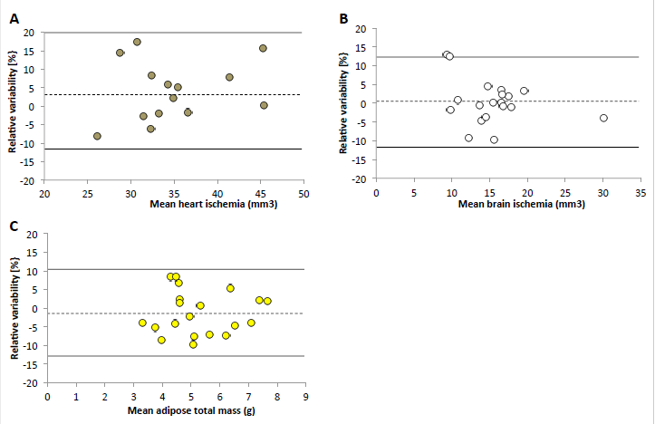

# ClinicalVolumes-medical-imaging-software

## Abstract
Background: Modern medical imaging relies on the accurate and rapid image analysis due to the large size of datasets collected on a daily basis both in clinical and pre-clinical imaging, for diagnosis, treatment planning, and research purposes. In order to improve the technology behind such requirements, here we introduce a new image analysis software called ClinicalVolumes. ClinicalVolumes is a semi-automatic image volume analysis tool based on a clustering signal intensity threshold-based method. It has been developed in C++ and can run on both Windows and Mac OS X operating systems. The program is currently available for research use only at https://www.kaggle.com/datasets/prot78/clinicalvolumes. 

Results: ClinicalVolumes has been validated with several MRI applications but it also can process Echocardiography and CT images. MRI datasets of clinical cardiac cases, and pre-clinical mouse models of heart, brain and adipose tissues have been analyzed by the ClinicalVolumes software and results were compared to a full manual segmentation. Bland-Altman analysis, intra- and inter-observer variability are reported for all investigated MRI applications as a numeric validation. The accuracy error was estimated to be below 10% and the segmentation was from 2 to 4 times faster, depending on the application, when compared to a full manual segmentation.

Conclusions: ClinicalVolumes is a fast, robust, user-friendly and accurate tool for image segmentation aimed to improve volume analysis in numerous medical applications ranging from cardiovascular disease to tumor and brain imaging.           

Keywords: segmentation; volumes; MRI; Echocardiography; CT; clinical; pre-clinical; DICOM.

## Background
Image segmentation plays a central rule in the increasing number of multidimensional and multimodality datasets generated by digital imaging techniques [1, 2]. The medical field, in particular, relies on computer programs to study the large amount of data collected by medical equipment, such as Magnetic Resonance Imaging (MRI), Echocardiography or Computer Tomography (CT), in order to improve diagnosis or determine appropriate treatment [3]. The progression towards automated or semi-automated segmentation software, which can provide accurate results in a shortened analysis time, is therefore of critical interest [4].

Tissue volume analysis such as that of heart [5], brain [6], cancer [7], vascular tissues, bones, or adipose tissues [8], provides a powerful tool to investigate functional and volumetric parameters. In cardiac studies, for instance, ejection fraction (EF), left ventricle end-diastolic volume (LVEDV) and left ventricle end-systolic volume (LVESV), are essential parameters to determine the conditions of the organ and the health status of the patient. An accurate and reliable segmentation of the left ventricle (LV) is therefore of great clinical and pre-clinical interest. The same applies to all medical imaging fields where accurate and reliable segmentations can result in useful diagnostic information so as to help target treatments. 

Recent years have seen a rapid evolution of medical image analysis software [4, 9-11]. However a large number of those are specifically designed to investigate single organs rather than providing a means for broader applications. The software here introduced, named ClinicalVolumes, was validated on MR volumes but has the potential to also analyze images from other medical imaging modalities including echocardiography, computed tomography (CT) or positron emission tomography (PET) in addition to be a specific application software. ClinicalVolumes is able to reduce analysis time with respect to a full manual segmentation by using an efficient clustering threshold-based technique to limit areas of interest and also by a rich set of user-friendly graphical-editing capabilities. The software exploits an automatic segmentation together with a user-friendly manual image optimization approach thus making ClinicalVolumes a valuable semi-automated program. 

The accuracy and efficiency of the new software has been evaluated for several MRI applications and the results are here reported. The tool is routinely used to perform cardiovascular MRI image analysis in our laboratories, thereby providing valuable diagnostic information for pre-clinical studies in murine models of cardiac diseases [12]. 

## Method
The design, implementation, medical applications and validation of the software are described in this section.

### A. Design

A.1. Overview

ClinicalVolumes is a volumetric analysis software relying on an efficient clustering threshold-based technique to limit areas of interest in a semi-automated way. The software is intended to process images or image stacks (a single image (2D), a time-resolved single image (2D+T), a stack of images representing a multi-slice image volume (3D) or a time-resolved multi-slice image volume (3D+T)).
The software loads and stores data in DICOM format, the standard format for handling, storing, printing, and transmitting information in medical imaging. Single volumes are typically uploaded and analyzed. This operation itself neglects the use of very large datasets of the order of Gigabytes (single medical volumes are usually smaller than 1Gb) which could exceed the computer RAM, used for I\O, thus sensibly affecting the analysis time.
When working with 3D+T images, the data is visualized and processed in four main modalities, which can be selected by the user: single-frame, single-slice, multiple-frames and multiple-slices.
The image analysis is achieved by segmenting the areas of interest with a threshold-based technique: a set of connected pixels, called “cluster”, with Signal Intensities (SI) contained within a user-selected intensity window can be generated in an area of interest. The cluster can be propagated through the volume making left ventricular endocardial border detection a trivial task. For accuracy purposes the cluster can be locally improved whenever the region of interest becomes inadequate. This can be carried out by manually modifying the cluster; mouse-based editing capabilities serve this purpose. ClinicalVolumes can also generate multiple clusters in different areas simultaneously. All the editing options are accessed with the mouse. 
The software also enables the employment of a series of options during the segmentation process. With a single mouse click, the aforementioned cluster can be expanded to any frame or slice. Single or multiple slices can be selected to be included or excluded by the segmentation activities. Commands such as global and selective zoom, contrast adjustment, ROIs for signal intensity histogram, sector and spline-based analysis have been successfully integrated. All the features provide a user-friendly approach to the program.  

A.2. Clustering algorithm

ClinicalVolumes segments volumes by generating a cluster from a user-selected image position that is then propagated to nearby pixels. The cluster expands through those image pixels whose signal intensity falls into a user-selected intensity window. The clustering algorithm uses the following inputs:
(a) the intensity of each pixel of the slice to operate on;

(b) the buffer that stores the editing color for each such pixel, called `color buffer';

(c) the currently selected editing mode and color;

(d) the coordinates of the selected pixel in (a)
from which the clusterization is started;

(e) the function that 
determines what is the action to undertake on a currently processed pixel
given its intensity, its color (if any) and its mode and color.

Furthermore, the clustering relies on a graph growing propagation scheme based on the usage of temporary buffers which register and exchange input information. 
The clustering algorithm was implemented as followed.
Firstly, the current editing color is written in the color buffer at the position
indicated by the coordinates of the selected pixel (d) (step 1). The coordinates of the selected pixel are registered in the first temporary buffer (step 2).
The eight neighbor pixel of the mouse-pointed pixel are examined. The
neighbor pixels are (re)colored, if deemed so according to (e), and
their coordinates are written in the second temporary buffers (step 3).
The two temporary buffers are than swapped and the number of non-empty
elements of the first temporary buffer is zeroed (step 4).
Steps 3) and 4) are repeated for each pixel indicated by the first temporary
buffer, instead of the mouse-pointed pixel - as specified in (step 3) - until this buffer
is empty.
The clustering algorithm operates sequentially on multiple image slices or on 
the current one only, depending on the editing mode decided by the user. For a 
specific slice, the algorithm takes as input: 
(a) the coordinates of the slice pixel 
defined by the mouse and the current screen-to-slice mapping parameters, 
(b) the 
pixel intensities of the image slice, 
(c) the buffer that registers the colors of the 
pixels of that slice, 
(d) the editing color currently selected by the user and 
(e) a 
function which determine what to do at a 
pixel position having as input its intensity (from (b)), the registered color (if any, 
from (c)) and the user-selected editing color (i.e. (d)).



The clustering algorithm relies on a graph growing propagation scheme and
is here described in more detail. If the function which determines what to do at a 
pixel position decides that the mouse-selected pixel
should not be (re)colored, the clustering does not start, otherwise the color
buffer is locally modified and the coordinates of the above pixels are registered
in a temporary buffer. Then, if the temporary buffer is full, the propagation
scheme proceeds by examining the content of the elements of the image slice
and of the color buffer corresponding to the eight pixels that are adjacent to the
mouse-selected pixel. Consequently, the clustering process employs the function which determines what to do at a 
pixel position to
operate as for the first pixel and registers the pixel coordinates of the (re)labeled
color buffer elements in a second temporary buffer. In the successive step, if the
latter is empty the procedure ends, otherwise the two temporary stacks are swapped,
the number of filled elements of the second temporary buffer is zeroed and the
clustering process continues as before. As such, this terminates whenever an
algorithmic step does not label any element of the color buffer. 
This clustering scheme is of recursive nature because from a parent pixel
multiple adjacent pixels are considered and each of these, in turn, may trigger
the inspection of many other pixels, thereby eventually producing an exponential
increase of work. Noteworthy, the presently described version is iterative, which
enhances processing performance with respect to a recursive version relying
on the slow management of temporary stacks automatically carried out by
the current programming environment.

A.3. Programming environment

ClinicalVolumes is written in C++ and is portable to 32-bit and 64-bit Windows operating systems and Mac OS X.
The software architecture consists of three main layers, as shown in figure 1: the third-party libraries providing visualization, user interaction and I/O functions; the ClinicalVolumes Application Programming Interface (API) consisting of a set of libraries implementing optimized in-house functions for high performance 3D+T image processing and specific I/O functionalities; the ClinicalVolumes Graphical User Interface (GUI) containing the controls needed for the user to interact with the data.

.

Figure 1. Schematic representation of ClinicalVolumes architecture. Graphical User Interface (GUI), Application Programming Interface (API) and the third-party libraries are schematically reported.

ClinicalVolumes relies on three main third-party libraries: Insight Segmentation and Registration Toolkit (ITK); Open Graphics Library (OpenGL); Qt (figure 1). 
•	ITK: is an open-source cross-platform set of libraries for medical image analysis. ClinicalVolumes uses ITK [13] mainly to manage the reading and writing of images using the DICOM standard through the Grassroots DICOM (GDCM) library. GDCM is an open source, cross-platform library for reading and writing DICOM files. 
•	Open Graphics Library (OpenGL) [14]: is an industry standard graphics library for cross-platform, hardware-accelerated and high performance 2D and 3D image visualization. OpenGL allows the user to take advantage of hardware acceleration by graphics cards. OpenGL is ideal for 3D rendering, but it also performs extremely well on 2D rendering functions. However, it provides little support for creating user interfaces for complex applications.
•	Qt [15]:  is a cross-platform library for application building and user interface creation. It includes, among others, functions for file I/O, event handling and multithreading and a set of customizable widgets. As a central feature of Qt, signals and slots are used for communication between objects, by implementing the observer pattern in a simple and type-safe way. In addition, Qt includes a module specifically implemented to perform 2D and 3D renderings with OpenGL. 
The above third-party libraries have been selected to take advantage of system resources for maximum graphics and interaction performance, which is of great importance, in particular, for cardiac imaging where the volumes are frequently large and multidimensional in space and time. 
The ClinicalVolumes API also includes four main libraries specifically developed to provide quick and reliable management, including customized visualization and quantification, of medical image data:
•	The I/O library provides the functions needed to:
−	read/write DICOM files;
−	store/retrieve segmentation and quantification results.
•	An in-house visualization library, “Vis”, provides the functions needed for:
−	2D and 2D+T visualization of volume images and segmentations;
−	3D and 3D+T visualization of volume images;
−	Zoom, pan and layout optimization;
−	Adjustment of image brightness, contrast and opacity.
•	An in-house segmentation library, “Segm” includes the functions needed for the semi-automatic segmentation of different anatomical structures, including:
−	threshold-based pixel clusters generation;
−	manual addition/removal of pixels group;
−	segmentation propagation to other frames/slices.
•	An in-house library, “Calc”, is devoted to perform all the calculations needed for the quantification of the segmented structures, including areas, volumes and weight estimations. In particular, for cardiac applications, the end-diastolic (EDV) and end-systolic volume (ESV) frames, ejection fraction (EF), cardiac output (CO) and stroke volume (SV) are automatically computed.
The ClinicalVolumes GUI contains all widgets needed for the user to interact with its API. The GUI implementation relies on the customization of widgets provided by Qt and on the implementation of specific signals and slots for the communication between objects. Its main window consists of: 
−	an OpenGL widget that allows the access of all the visualizations and segmentation features, for optimized graphics performances; 
−	all control/mouse widgets, toolbars, menus as described in the section below;
−	all mouse and keyboard controls.

### B. Implementation

ClinicalVolumes has been designed to maximize the workflow efficiency and user friendliness for the analysis of clinical and pre-clinical images from MRI, Echocardiography and CT. To this end, the interface has been maintained as intuitive as possible. Figure 2 shows a snapshot of the program interface where the principal commands are explained. ClinicalVolumes includes several features in order to engage rapid and accurate segmentations. First, clusters can be generated in a single, multiple frame or multiple slice editing mode leaving the user to personalize data analysis in the most preferable way. A manual intervention can also be engaged as a mean to optimize the segmentation process. 
Segmentation is generally carried out by applying clusters with specific editing characteristics. Such attributes are primarily related to the application of signal intensity thresholds. The thresholds can be applied, for instance, to segment an area of higher signal intensity to that of a lower intensity; they are automatically placed by a single click of the mouse and they can be manually adjusted at all times. These editing actions will modify the shape and size of the cluster which is visualized and updated in real time in the current image viewport. In addition, not only the threshold levels can be varied but also single or multiple pixels can be locally included or excluded from the segmentation. These two actions together are the primary action of the semi-automatic tool. 
The use of options can also be very useful during image analysis. Among those, the use of spline for a precise selection of local areas; sector segmentation to evaluate volume changes through time in a selected cluster partition; selection of an ROI dedicated to a pixel to pixel signal intensity analysis; the introduction of density factors which can be multiplied by the segmented volume to have an automatic estimation of, for instance, tissue weight such as myocardial mass or fat; the recording of image segmentation and its volumes utilized whenever the same volumes are needed for further examination. The implemented multi-thresholding, multi-frame and multi-slice editing modalities are a means of providing the user with tools to personalize and speed up the segmentation. All options are easily accessible through the toolbar, menus and control widgets of the interface. 
ClinicalVolumes can also deal with large image matrixes which are typical for clinical examinations such that of clinical cardiovascular examination where a matrix of 256x256x12 in the 3D space and 30 in the temporal dimension are common. In particular, the software has been validated by analyzing cardiac images where functional and volumetric information are provided in real time during the segmentation. The current frame and slice numbers and the cluster option information are also reported in real time easing the image analysis process. 

.

Figure 2. ClinicalVolumes interface. All the main commands are displayed at the top and right hand side of the main window. Volumetric information and cardiac parameters such as the maximum volume frame (end-diastolic ED), minimum frame volume (end-systolic ES) and ejection fraction (EF) are visualized in real time at the corners of the main interface image. Cluster threshold values are also visualized once selecting a color option.

### C. Medical applications
The following section discusses some of the ClinicalVolumes image analysis applications. 

C.1. Myocardium 

ClinicalVolumes has been primarily optimized for segmentation and analysis of dynamic cardiac MR images. The myocardial wall and cavity volumes of the left ventricle are segmented by identifying epicardial and endocardial borders within each slice and timeframe. The endocardial border is detected by creating a cluster in the left ventricle blood pool due to the contrast generated between blood and myocardium wall. The endocardial border is therefore containing the cluster expansion within the blood pool thus defining LV segmentation. Global functional and volumetric parameters such LVEDV, LVESV, EF, stroke volume (SV) and cardiac output (CO) are automatically calculated [12]. End-diastolic and end-systolic frames are computed in real time. At completion of the LV segmentation, the end-diastolic slices are used to calculate the LV mass by manually placing a cluster between the endocardial and epicardial border thus segmenting the LV septum. The LV mass is calculated as follows:
LV mass = end-diastolic myocardium wall volume * myocardium density factor.      1)
The end-diastolic volume is defined in cm3 and the myocardium density factor is equal to 1.055 g/cm3.

C.2. Areas of ischemia 

ClinicalVolumes has been applied to an ischemia mouse model of the heart (in-vivo) and brain (ex-vivo). Ischemic and healthy tissue areas are distinguished via the contrast generated by T1 weighted MRI sequences after gadolinium administration. Late gadolinium enhancement (LGE) MRI technique was engaged after injection of gadolinium-DTPA to localize and characterize infarcted areas. The technique is commonly used in clinical and pre-clinical studies [12, 16]. In the ex-vivo brain case, no contrast agent was utilized. 
ClinicalVolumes segmented the infarcted regions using a threshold-based clustering approach. The segmentation was then propagated to all slices and manual intervention engaged for optimization. 

C.3. Total adipose tissue mass

ClinicalVolumes was employed to analyse a pre-clinical mouse model for total fat calculation. Total adipose tissue includes mainly subcutaneous and internal fat [17]. T1 weighted MRI sequences were employed for fat detection due to the high contrast generated between the latter and the remaining tissues. Total adipose tissue was calculated as: 
adipose tissue mass = adipose tissue volume * adipose tissue density factor              2)
where total adipose tissue volume is estimated in cm3 and the adipose tissue density factor set equal to 0.9 g/cm3 [18]. 
The ClinicalVolumes signal intensity thresholding approach was used and applied to all the images of the volume simultaneously to minimize the segmentation time. Manual corrections were applied to remove those segmented regions that, although free of fat, presented with signal intensities similar to that of adipose tissues. 

C.4. Brain and tumors

Brain images were acquired with T1 and T2 weighted MRI sequences where white and gray matter areas can be differentiated based on the relative T1 and T2 relaxation times. After the application of a cluster, some manual intervention was required to optimize the latter. 
Similarly, tumors were also primarily detected by T1 and T2 weighted MRI techniques with or without the use of gadolinium agents. 

C.5. Echocardiography

Clinical and pre-clinical echocardiography volumes can be efficiently uploaded and analysed by ClinicalVolumes. The software provides an Echocardiography option to determine image resolution which, in contrast to MR images where image resolution is defined by the number of pixels in the field of view, depends on the transducer utilized. Although the software is able to visualize and segment 2D echocardiography images, a Simpson volume analysis method [19] will have to be implemented to achieve the correct functional and volumetric cardiac parameters. The same ClinicalVolume option for image resolution can be applied to CT volumes where the dimension of the picture is related to the distance between the object under observation and the X-Ray source. 
Figure 3 shows the use of ClinicalVolumes segmentation in Echocardiography volumes. Diastolic and systolic segmentation including sector analysis was performed. 

.

Figure 3. Echocardiography segmentations. In Echocardiography, diastolic and systolic images have been segmented to study volumes and evaluate EF. Sectors (right echocardiography images) can be applied to the segmentation analysis in order to characterize abnormality in specific areas of the myocardium. 

### D. Validation
ClinicalVolumes was validated against a full manual segmentation in three medical applications: 
1) cardiac functional/volumetric parameters (13 human cases [analyzed by an experienced clinician and a senior scientist] ; 15 pre-clinical murine cases [analyzed by senior scientists]); 
2) ischemia volumes (15 pre-clinical cases of  in-vivo mice hearts; 19 pre-clinical cases of ex-vivo mice brain) [analyzed by senior scientists]; 
3) total adipose tissue mass estimation (20 pre-clinical cases of in-vivo mice) [analyzed by senior scientists]. 

D.1. Datasets

Each human cardiac volume was obtained with a steady-state free precession (SPSS) cine MRI sequence in healthy volunteers, consisting of 12 short-axis slices of 30 frames each [20, 21]. Field of view (FOV) 37x37x96 cm3, matrix size 256x256 and heart rate 7015 heartbeats/min. The preclinical cardiac data were obtained with a multi-slice gradient echo cine sequence, consisting of 9 short-axis slices of 12 frames each [12]. FOV was 25x25x9 mm3, matrix size 128x128 and heart rate 40035 heartbeats/min. The pre-clinical datasets were also used for evaluation of infarct size because the mice underwent coronary ligation 3 days prior to MRI (3 days post MI). Pre-clinical brain ischemia [22] and adipose tissue [8] volumes were acquired with a spin-echo technique. 50 slices were typically analyzed in both cases. FOV 40x40x50 mm3 for brain ischemia and 40x40x100 mm3 for adipose tissue. C56B16 black mice (age 8 to 12 weeks) were used in all pre-clinical experiments. 

D.2. Image analysis

ClinicalVolumes and a full manual segmentation image analysis were performed in all studies where intra- and inter-observer variability was estimated. Such analysis and the resulting accuracy are based on a numerical study and not on an absolute approach where segmented regions, obtained from the software and a manual approach, are overlapped in order to define an absolute accuracy. 
Two scientists with at least 3 years of MR experience performed data analysis in all cases. They were both trained to use the ClinicalVolumes software as well as undertook a manual segmentation. Full manual segmentation was carried out with Osirix (OsiriX Imaging Software. http://www.osirix-viewer.com). Intra-observer variability of the individual methods was obtained from the measurement differences between the mean values of two successive segmentations achieved by observer A. Inter-observer variability was estimated by the difference between the segmentation results obtained by an observer A and an observer B. Intra-operator variability across the two different segmentation approaches is also reported. Bland-Altman statistics were utilized to investigate the accuracy of the two methods. The latter reports the relative difference (in percentage) between the numerical values created by ClinicalVolumes and those achieved with the manual segmentation with a  2 SD. A two-tailed paired Student’s t-test was used to determine any significant differences (P < 0.05). Excel was used for statistical analysis. 

### E. Full manual segmentation
Full manual segmentation was carried out and the results compared to those generated by the ClinicalVolumes software. The full manual segmentation of clinical and pre-clinical myocardium started by identifying end-diastolic and end-systolic frames. Functional and volumetric parameters were calculated following the same equations utilized for the semi-automated analysis. About 10% of the time utilized for a full manual segmentation was invested to manually editing the results on an Excel sheet. This operation was not needed when using ClinicalVolumes because the results are automatically provided by the software.
In the case of heart and brain ischemia and also for adipose tissues, the manual segmentation was performed slice by slice. 

## Results
### A. Applications

A.1 MRI

A.1.1. Heart
As previously described LV blood pool segmentation is based on confining a cluster within endocardial borders while detection of epicardial borders is utilized for the calculation of LV mass. The cluster border optimization process, based on signal intensity threshold, is shown in figure 4A to 4D. Figure 4E illustrates the contour of such segmentation. Contours are only a visual representation of clusters and they can be enabled or disabled by an option command. LV segmentation of clinical (figure 4F) and pre-clinical (figure 4G) data at end-diastole are also reported. Multiple slices are shown concurrently as ClinicalVolumes can visualize and/or process multiple parts of the same volume simultaneously (see the implementation details).

The segmentation time is strictly related to the number and quality of the images. In high quality volumes, where blood and myocardium are clearly distinguished (high contrast), the whole clustering and associated optimization can be achieved in less than a minute due to a minimal manual intervention. This is true in large (1024x1024 matrix size, 8 mm thickness with 12 slices and 30 images collected along the heart cycle, for instance) as well as in small (64x64 matrix size, 1 mm thickness with 7 slices and 6 images collected along the heart cycle, for instance) cardiac datasets. However, whenever image quality is degraded, the optimization task, including the manual adjustments of the end-diastolic and end-systolic frames, can increase the analysis time to an average of about 9 minutes for clinical and 4 minutes for pre-clinical volume respectively (measurements not shown). The time difference between clinical and pre-clinical data analysis is proportional to the number of images. The semi-automated method was several fold (3 to 4) faster than a full manual segmentation analysis (typically about 25 and 15 minutes for clinical and pre-clinical volume respectively). A more detailed image of a non-segmented (original) and segmented end-diastolic heart is shown in figure 6A.

.

Figure 4. LV blood pool and myocardial septum segmentation for clinical and pre-clinical volumes. The cluster optimization process on the left ventricle cavity is reported in the upper image row (from A to E).  The cluster will be smaller (B or expanding outside the LV cavity (C when the applied cluster threshold is respectively lower or higher than the optimal value (D. The cluster border can also be visualized (E. Once achieved the best cluster threshold, a full clinical (F, or preclinical (G segmentation can be accurately obtained by automatically applying the cluster to the entire volume. 

A.1.2. Heart and brain ischemia

In-vivo heart and ex-vivo cases of brain ischemia are shown in figure 5. In figure 5A, viable tissue, blood and ischemic regions are identified and segmented by the use of three different colors representing three different segmentation options. Volume information was provided at the end of the analysis in the ClinicalVolumes output text file. The segmentation analysis time was about 5 minutes for each volume, compared to the 10 minutes manual segmentation (measurements not shown).
Figure 5B depicts regions of brain ischemia (highlighted in orange). The analysis time was about 10-12 minutes, which was two fold faster than that of a full manual segmentation (about 20 minutes) (measurements not shown).

.

Figure 5. Ischemia mouse model for in-vivo myocardium and ex-vivo brain. Regions of ischemia are segmented and differentiated from regions of valuable tissue. The different colors reported in the segmentation correspond to different features of the applied clusters. 

A.1.3. Brain and tumor

White and gray brain matter can be identified and differentiated by applying a segmentation based on the contrast generated between the two corresponding areas (figure 6B). In a similar manner, tumor borders can be identified. Any tumor area showing a distinctive contrast compared to healthy tissue can be resolved. In some cases this might include the use of contrast agents (figure 6B).

A.1.4. Total adipose tissue mass

Total adipose tissue was segmented as in figure 6C. After finding the best intensity signal threshold a cluster was applied on a single image and propagated to all images in the volume. Manual intervention was engaged to exclude subcutaneous fat, after recording the total fat values, in order to estimate the internal fat. Subcutaneous adipose tissues enhance regions along the perimeter of the abdominal image and can therefore be easily identified. ClinicalVolumes typical analysis time was about 9 minutes. In contrast, a full manual segmentation required about 35 minutes (measurements not shown).

.

Figure 6. Volumetric models for in-vivo images of myocardium A) brain B) and adipose tissues C). Non segmented (original) and segmented images are reported. 3 different colors intervene in the segmentation.

### B. Validation

B.1. Myocardium

The validation of human and pre-clinical cardiac datasets was carried out by comparing ClinicalVolumes results to a full manual segmentation analysis. Papillary muscles and trabeculations were excluded in the segmentation of the left ventricle blood pool. Functional and volumetric parameters were derived from the analysis of the end-diastolic and end-systolic frames, which were automatically identified by ClinicalVolumes or manually selected by the operator when adopting the full manual segmentation method. Figure 9 reports intra- and inter-observer variability, mean and relative differences, for two analysis approaches. The majority of the data confirm a more precise and accurate numerical data analysis after the ClinicalVolumes investigation although there are cases where a full manual segmentation achieves better results, such as in the EDV intra-observer or in the mean of the ESV inter-observer. Table 1 shows intra-observer variability of the segmentation methods. A Bland-Altman analysis of the principal functional/volumetric parameters is shown in figure 7. The reported accuracy was about 10% both for human and pre-clinical datasets.

.

Figure 7.  Bland-Altman plot of clinical (above) and preclinical (below) cardiac MRI data for EDV, ESV EF and Mass. Manual and ClinicalVolumes measurement from tester A were compared in order to achieve the relative variability values reported on the ordinate axis. The continuous and dashed line indicates the mean of the differences and 2 SD, respectively.

B.2. Heart and brain ischemia
In-vivo heart and ex-vivo brain ischemia intra- and inter-observer variability, mean and relative differences, for ClinicalVolumes and full manual segmentation, respectively are reported in figure 9. Also in these cases ClinicalVolumes seems to report higher precision and accuracy than a full manual segmentation.  Table 1 shows intra-observer variability of the segmentation methods. Figure 8A and 8B report the Bland-Altman analysis for heart and brain ischemia, respectively. The respective accuracies were about 16% and 11%. 

.

Figure 8. Bland-Altman plot for heart ischemia A), brain ischemia B), adipose tissues total volume C). The relative difference values derived by the analysis achieved from observer A when relating ClinicalVolumes to a full manual segmentation. The continuous and dashed line indicates the mean of the differences and 2 SD, respectively.

B.3. Total adipose tissue mass
The total pre-clinical in-vivo adipose tissue mass is reported in figure 9 with both intra- and inter-observer variability associated with ClinicalVolumes and manual segmentation. ClinicalVolumes is definitely reporting better results than a full manual segmentation. Table 1 shows the intra-observer variability of the two segmentation methods. Figure 8C reports the Bland-Altman analysis results, which demonstrate an accuracy of about 10%.

Figure 9. Intra and inter observer values of ClinicalVolumes and Manual segmentation. Mean and relative values ± SD are reported. Note: The mean difference for the intra-observer variability is calculated as mean of first segmentation minus second segmentation observer A. This difference is divided by their average to get the relative difference as a percentage. The mean difference of the inter-observer variability is calculated as mean of the difference between observers A and B for the given method. This difference is divided by the mean of both to get the mean percentage difference. *P < 0.05 first versus second segmentation observer A or **segmentation observer A versus observer B 
    
## Discussion
This paper presents ClinicalVolumes as a robust and flexible computer program for rapid volumetric segmentation and quantification where a threshold method embedded into a semi-automatic tool is able to provide accurate and fast volumetric data analysis. Its application to various medical scenarios, which differentiate such computer program from similar tools, and its validation on MRI datasets are reported. Although Echocardiography and CT volumes can be studied giving it a multimodality appearance, the software has not been fully validated for these two modalities.

ClinicalVolumes was used to segment several types of MRI images. The primary software application is the segmentation of the myocardium where functional and volumetric parameters such as end-diastolic volumes, EF and myocardial mass are estimated for further analysis. LV segmentation is of great clinical and pre-clinical interest since it provides a direct measure of the health of the organ therefore influencing the diagnostic and treatment planning. LV segmentation can be performed by simple mouse-based editing operations so as to provide a user-friendly high interactive and efficient method of analysis. Similar segmentation processes can be applied to brain images, adipose tissues and regions of disease such as ischemia and tumor. In our studies, the software has also been applied to vascular images as to estimate the vessel volume during diastole and systole [23], or to the estimate vessel wall area and plaque volume after contrast agent injection [23]. Echocardiography and CT images might be segmented in a similar manner although a validation of the latter is still in progress.

This study reports the validation of the software against manual segmentation. The intra- and inter-operator variability of ClinicalVolumes is low with a high degree of confidence. In all analyses our semi-automatic software never exceeded 10% relative difference which compares favorably with respect to the results of Riegler et al. [24] where similar analyses were conducted for studying pre-clinical cardiac volumes using standard market software such as Segment [25] and CMRTools [11]. Riegler et al. also reported the latter software to save up from 20% to 70% in analysis time, data which are in agreement to that of ClinicalVolumes. Regarding the accuracy of our full manual segmentation it can be mentioned that we achieved similar values to those of Heijman et al. [4]. Heijman et al. demonstrated that manual segmentation is slightly more accurate than a full automatic segmentation in the mouse heart at the expense of longer analysis times. To some extent, this work is indirectly confirming that a semi-automatic method provides a good compromise between an high level of accuracy and a fast analysis time. ClinicalVolumes is therefore providing high accuracy and repeatability when compared to a full manual segmentation. The latter constitutes an encouraging accomplishment considering that ClinicalVolumes does not rely on complex algorithms for determining the area borders but solely on an efficient clustering multi-slice signal intensity thresholding method. Such positive outcomes could represent the first step to re-establish the threshold approach, when accompanied by a robust and user-friendly clustering semi-automatic tool, as a valuable method of medical images analysis. It is interesting to note that the results obtained for the clinical examples were more accurate than those of the pre-clinical cases. A likely explanation is to be found in the presence of better image quality produced in clinical setting than typically achieved in the pre-clinical environment. Pre-clinical acquisitions are in fact subjected to fast heart rate and turbulent blood flow hence introducing significant image artifacts that bias the intra- and inter-observer analysis. 

The robustness and accuracy of the ClinicalVolumes thresholding method is directly dependent on the contrast and image resolution of the volume under scrutiny since the method is carried out on a per pixel basis. The latter reduces the error due to subjectivity when pixels are to be included or excluded in the segmentation. On the other hand, the manual segmentation (using Osirix) adopted a “spline” technology to limit endocardial and epicardial borders making it less dependent on contrast and high resolution but more prone to user defined errors.  

ClinicalVolumes has, in our opinion, several advantages, also over similar tools, and some limitations. First, the simple selection and management of the embedded functionalities provide a user-friendly and complete instrument in the segmentation task. Most of the functionalities are accessible through the sole use of the mouse while the graphical interface has been designed to be as intuitive and simple as possible. Second, manual intervention is used as a supporting tool to optimize the segmentation and it is believed to embed a simple and user-friendly approach thus influencing positively on the segmentation analysis time. Lastly, the segmentation can be “personalized” and the analysis time boosted by choosing among several different options such as the multi-slice or multi-frame editing modes, the use of ROIs to identify the signal intensity in a specific area or adopting a sector analysis to study the volumetric change of a region through time.

Mentioning some of the disadvantages, ClinicalVolumes can engage and apply clusters in few seconds throughout the volume, but often the clustering approach alone does not achieve an ideal segmentation with the disadvantage of having to invest few minutes to inspect and optimize the images manually. Also, ClinicalVolumes accuracy is limited to a single pixel making it dependent on the resolution of the image; therefore, when analyzing low resolution volumes, for instance 32x32 pixels, a zero filling is suggested to artificially increase the matrix size. 
ClinicalVolumes, as many other post processing platforms, is still works in progress. Implementation of the Simpson method for Echocardiography analysis, a validation of the latter and a validation of CT images are some of the projects already in the pipeline in addition to validate anatomical brain and tumor volumes in clinical cases. These and other developments are indicated on the www.clinicalvolumes.com website. The latter is also providing with background information, instruction manuals, segmenting applications and the software program itself as a free-of-charge downloadable file under a GNU (General Public License) licensing agreement. 

## Conclusions
The new semi-automated multi-modality signal intensity based computer program presented here is a promising tool for image segmentation in several environments speeding up image analysis time when compared to a full manual segmentation. The robustness, efficiency and accuracy demonstrated by ClinicalVolumes while validating several MRI datasets makes this tool appealing to a vast range of medical applications. 

## Abbreviations
Magnetic Resonance Imaging (MRI); Computer Tomography (CT); ejection fraction (EF); left ventricle end-diastolic volume (LVEDV); left ventricle end-systolic volume (LVESV); left ventricle (LV); stroke volume (SV); cardiac output (CO); signal intensities (SI); Application Programming Interface (API); Graphical User Interface (GUI); Insight Toolkit (ITK); Open Graphics Library (OpenGL); late gadolinium enhancement (LGE); field of view (FOV); GNU (General Public License).

## Availability and requirements
The project name is ClinicalVolumes and the project home page is https://www.kaggle.com/datasets/prot78/clinicalvolumes. Pre-compiled versions of the software are available for Windows and Mac OS X. Programming language C++. Operating system requirements: Windows 7 of higher. ClinicalVolumes is freely available for investigational research purposes only, provided that relevant original research publications related to the software are cited. The program uses a GNU (General Public License) license. The software is not currently CE marked. The terms of the license do not include trials paid by pharmaceutical companies.

Table 1. ClinicalVolumes - Manual segmentation comparison. . Mean and relative values ± SD are reported in addition to the speed up factor. 
